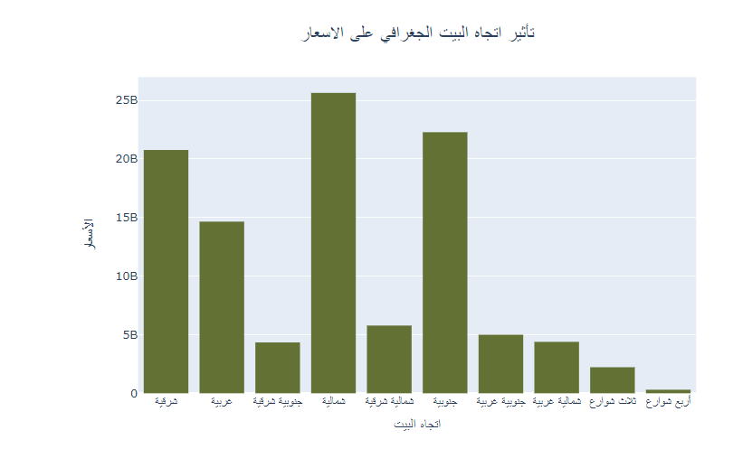
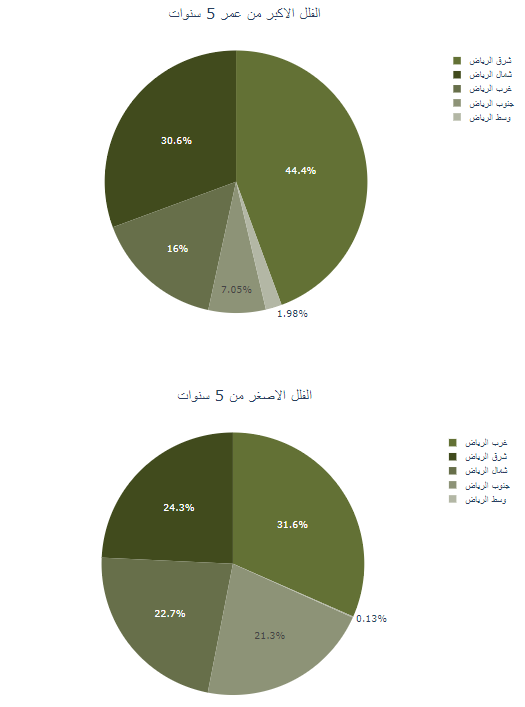
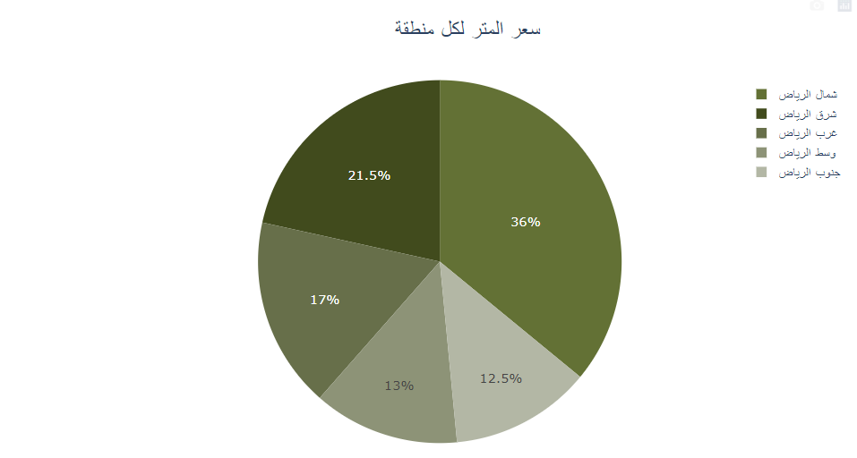
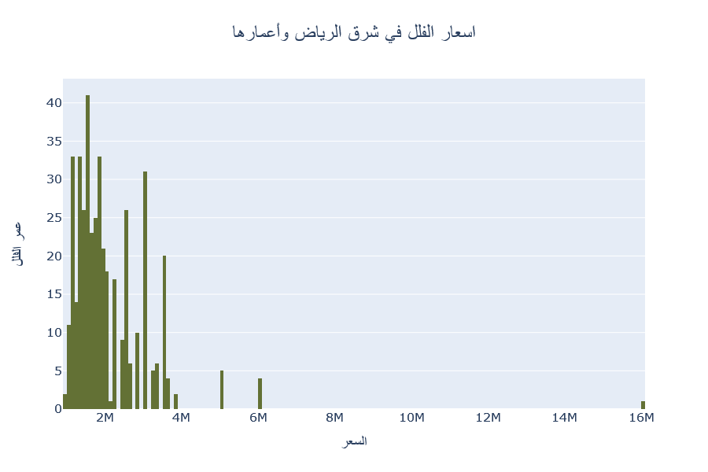
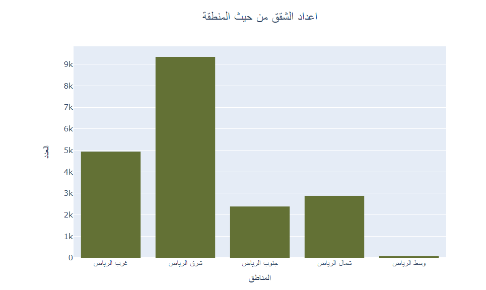
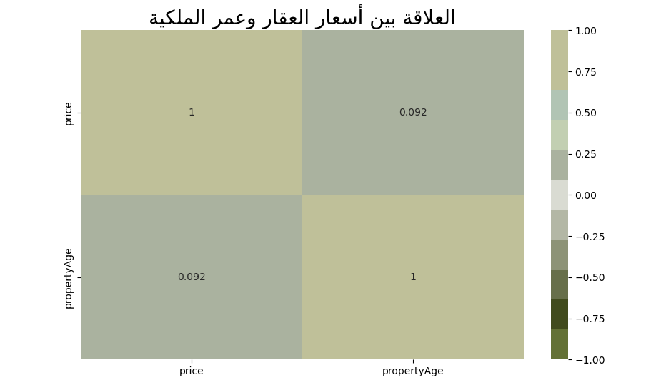
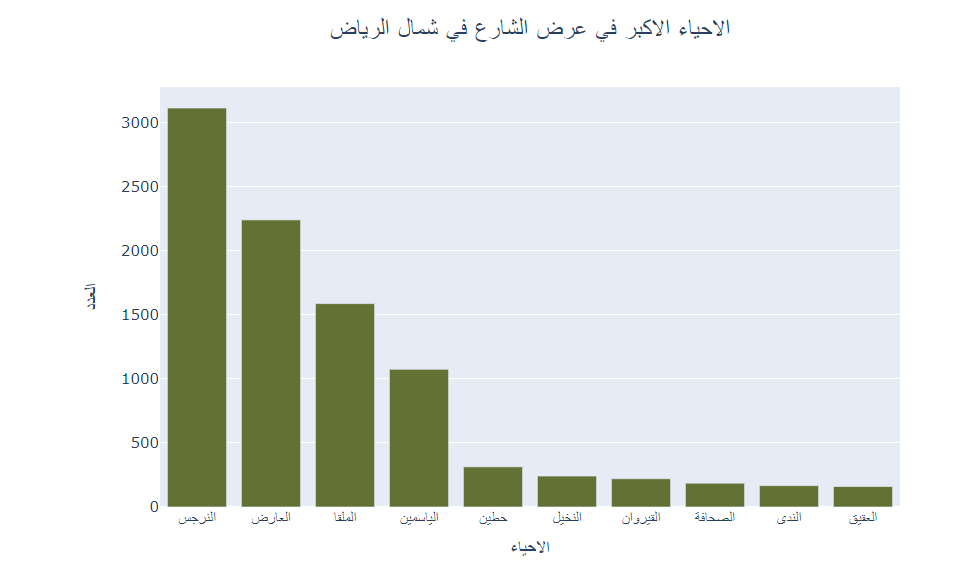
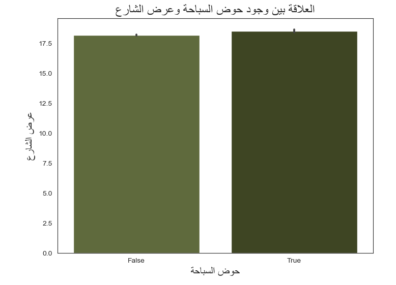
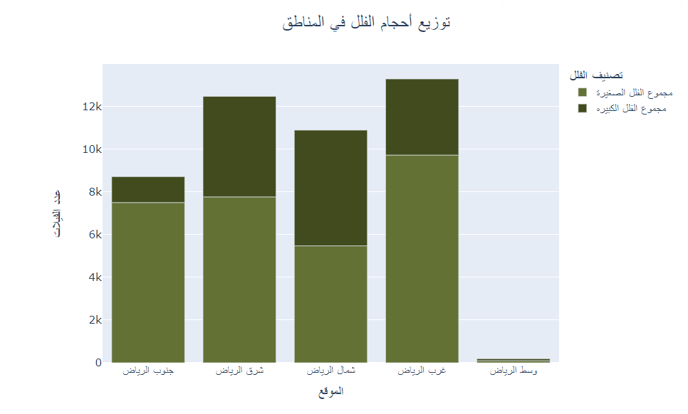

# Riyadh Villas Aqar Analysis

## Team Members and Duties

| Abdulrahman | Raghad | Hussam
|--------|-------|-------|
| writing readme file | source code management| writing readme file
| Data cleanse | Data cleanse | Data cleanse
extracting insights based on EDA | extracting insights based on EDA | extracting insights based on EDA 
| Choosing dashboard style | Picking Visualization style | source code management
| Developing Dashboard | Developing Dashboard | EDA

## Introduction :
 Are you new to Riyadh and contemplating the idea of buying a villa in this vibrant city? The prospect of finding the perfect villa can be both exciting and challenging, especially if you're unfamiliar with Riyadh's diverse neighborhoods and property market. We understand that choosing the right location for your villa is a crucial decision that can greatly impact your lifestyle and investment.

This analysis aims to be your guide to navigating Riyadh's villa market. Whether you're a newcomer to the city or a long-time resident looking to make a change, we've got you covered. We'll provide insights into the best areas in Riyadh for villa purchases, helping you make an informed decision that aligns with your preferences and priorities.

## Dataset Overview and Source

- [Riyadh Villas Aqar Dataset](https://www.kaggle.com/datasets/reemamuhammed/riyadh-villas-aqar)
- This dataset contains over 50k villas located in Riyadh, Saudi Arabia. Each villa contains information such as the location, neighborhood, number of bedrooms, number of bathrooms, the space of the villa, and many more!

## final ten insights.

1. **Effect of Geographical Orientation on Prices:**
   - 
   - Villas with a north-facing orientation tend to have higher prices due to their lack of exposure to natural factors such as sunlight and wind

2. **Larger and Smaller Villas Under 5 Years Old:**
   - 
   - Villas in the eastern region are considered the oldest among the other areas.

3. **Price per Square Meter for Each Location:**
   - 
   - The price per square meter in North Riyadh is considered the highest among the other areas.

4. **Number of Villas with Full Amenities in Each Location:**
   - 
   - The number of luxury villas is abundant in North Riyadh.

5. **Relationship between Villa Age and Prices in East Riyadh:**
   - 
   - Villas in East Riyadh are considered high-priced, despite being old. This can be explained by the fact that this area is economically strong, and therefore the villas are not affected even if they are old.

6. **Number of Apartments by Location:**
   - 
   - The presence of a larger number of apartments in East Riyadh is due to the larger size of villas and the availability of commercial centers in the area.

7. **Relationship between Property Prices and Ownership Age:**
   - 
   - The price of villas is not primarily affected by their age but rather by their location or position.

8. **Largest Neighborhoods in Terms of Street Width in North Riyadh:**
   - 
   - Street Width Distribution of Villas in North Riyadh:
   - This graph helps in understanding the distribution of street widths for villas in North Riyadh and how it varies from one neighborhood to another.

   - Illustrates Residents' Preferences:
   - The graph illustrates the preferences of residents in that area, as depicted by the concentration of villas in the Al Narges neighborhood.

9. **Relationship between Pool Presence and Street Width:**
   - 
   - The presence of pools is more common in streets with wider widths. This is because the residents in those areas prefer to have more space for their villas to ensure privacy.

10. **Distribution of Villa Sizes in Different Locations:**
   - 
   - There has been a shift in prevailing mindset regarding the purchase of villas with larger areas, as people are now inclined towards acquiring villas with smaller sizes
   

