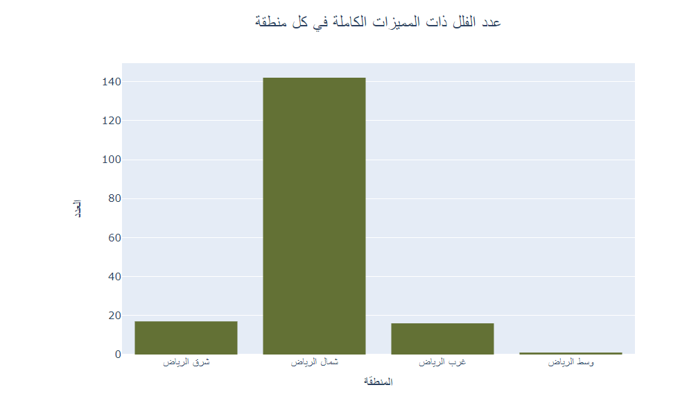

# Riyadh Villas Aqar Analysis

## Team Members and Duties

- ** :** ....
- ** :** ....
- **Hussam Alzahrani :** ....

## Introduction :
 Are you new to Riyadh and contemplating the idea of buying a villa in this vibrant city? The prospect of finding the perfect villa can be both exciting and challenging, especially if you're unfamiliar with Riyadh's diverse neighborhoods and property market. We understand that choosing the right location for your villa is a crucial decision that can greatly impact your lifestyle and investment.

This analysis aims to be your guide to navigating Riyadh's villa market. Whether you're a newcomer to the city or a long-time resident looking to make a change, we've got you covered. We'll provide insights into the best areas in Riyadh for villa purchases, helping you make an informed decision that aligns with your preferences and priorities.

## Dataset Overview and Source

Source :
[Riyadh Villas Aqar Dataset](https://www.kaggle.com/datasets/reemamuhammed/riyadh-villas-aqar)

## final ten insights.

1. **تأثير اتجاه البيت الجغرافي على الاسعار:**

2. **الفلل الاكبر والاصغر من عمر 5 سنوات:**

3. **سعر المتر لكل منطقة:**

4. **عدد الفلل ذات المميزات الكاملة في كل منطقة:**

5. **العلاقة بين عمر الفلل والأسعار:**

6. **أعداد الشقق من حيث المنطقة:**

7. **العلاقة بين أسعار العقار وعمر الملكية:**

8. **الاحياء الاكبر في عرض الشارع في شمال الرياض:**

9. **العلاقة بين وجود حوض السباحة وعرض الشارع:**

10. **توزيع أحجام الفلل في المناطق:**

